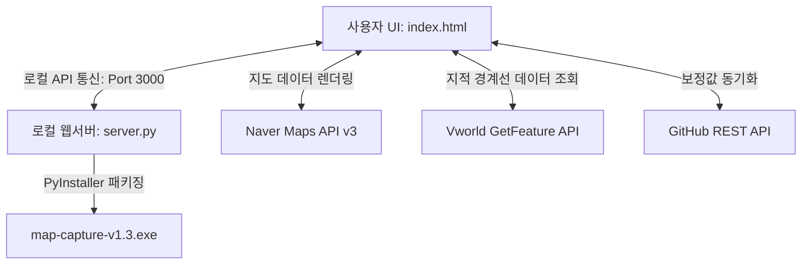

# 🗺️ 지적도 캡처 자동화 시스템 v1.3 기술 인계인수서 (Handover Document)

본 문서는 **지적도 캡처 자동화 시스템 v1.3**을 외부 전문가 또는 후임 개발자가 인수받아 원활하게 유지보수 및 기능을 확장할 수 있도록 시스템 구조, 핵심 기능의 기술적 구현 원리, 주요 버그 해결 이력 및 보안 유의 사항을 정리한 기술 명세서입니다.

---

## 1. 시스템 아키텍처 개요

본 프로그램은 웹 표준 기술(HTML5/CSS3/JavaScript) 기반의 UI 프론트엔드와 로컬 파일 시스템 제어 및 배포 편의성을 위한 Python 경량 백엔드가 결합된 **하이브리드 데스크톱 자동화 툴**입니다.



### 💻 프론트엔드 (UI & Map Controller)
* **구성 파일**: [index.html](file:///c:/AI/Map%20Capture2/index.html) (단일 파일 배포 구조)
* **역할**:
  * **네이버 지도 v3 SDK**를 연동하여 고화질 위성 지도 렌더링.
  * **Vworld GetFeature WFS API (Data Service)**를 호출하여 특정 좌표의 지적도 폴리곤 데이터(GeoJSON)를 수집.
  * 수집한 GeoJSON 폴리곤을 네이버 지도 커스텀 오버레이(`naver.maps.Polygon`)로 매핑하여 빨간색 경계선으로 드로잉.
  * `html2canvas` 라이브러리로 지도를 이미지로 변환하고, `jsPDF` 라이브러리로 클라이언트 단에서 직접 PDF 병합 및 렌더링 수행.

### 🐍 백엔드 (Local Server & Build Wrapper)
* **구성 파일**: [server.py](file:///c:/AI/Map%20Capture2/server.py)
* **역할**:
  * 로컬 호스트(`localhost:3000`)에 정적 리소스 서빙 및 로컬 전용 REST API 제공.
  * 프로그램 최초 실행 시 브라우저(`webbrowser.open`)를 자동으로 제어하여 UI 페이지를 활성화.
  * **오프셋 백업 API (`/api/save-offsets`)**: 브라우저의 미세 보정 좌표를 로컬 [index.html](file:///c:/AI/Map%20Capture2/index.html) 소스코드 내부에 정규식 치환 방식으로 영구 베이킹(Bake) 처리하여 빌드 시점에 기본값으로 병합시킴.
  * **빌드 패키징**: `PyInstaller`를 활용하여 Python 인터프리터와 `index.html`을 단일 실행파일(`map-capture-v1.3.exe`)로 원파일 패키징 처리.

---

## 2. 주요 기능별 구현 원리

### ① Vworld 2.0 지오코딩 및 도로명 폴백 (Geocoding Fallback)
* **구현 방식**:
  1. `parseKoreanAddr()` 정규식 파서를 통해 사용자가 입력한 주소에서 행정 구역명(동/읍/면)과 본번-부번(예: `447-2`)을 정확하게 분리합니다.
  2. Vworld Search API v2.0을 호출해 지번 주소(`category=parcel`)로 1차 검색을 시도합니다.
  3. 1차 실패 시, 도로명 주소(`category=road`)로 자동 전환(Fallback)하여 재검색합니다.
  4. 도로명 검색에 성공한 경우, Vworld가 응답한 속성 내에서 실제 법정동 및 본번-부번 데이터를 역으로 추출하여 지적 경계 매핑 시스템에 파싱된 상태로 전달합니다.

### ② 위성-지적 경계선 오프셋(Offset) 보정 알고리즘
네이버 위성지도의 기복 왜곡(Terrain distortion) 및 좌표계 원점 불일치로 인해 발생하는 1~15m 수준의 어긋남을 극복하기 위해 **4단계 보정 추적 시스템**을 구현했습니다.
1. **1단계 (Exact Match)**: 로컬 캐시 또는 GitHub 저장소에 해당 지번에 저장된 고유 보정값(`addressOffsets[address]`)이 있다면 최우선 적용.
2. **2단계 (Nearest Neighbor)**: 고유 보정값이 없는 신규 주소인 경우, 현재 지오코딩 좌표(위경도)를 기준으로 기존에 보정 완료된 다른 지번들과의 거리를 **하버사인(Haversine) 공식**으로 계산하여, **가장 가까운 거리(최인접) 지번의 보정 오프셋을 자동으로 상속**받음.
3. **3단계 (Regional Offset)**: 2단계 결과가 유효하지 않을 경우, 행정구역 앞부분 명칭(예: `대구광역시 북구 검단동`)으로 기 정의된 지역별 기본 오프셋을 매핑.
4. **4단계 (Global Default)**: 모두 실패할 시 기본값인 `{ x: 0, y: 14 }` 오프셋을 대입.
5. **수동 조정 및 저장**: 사용자가 방향키로 미세 조정한 값은 즉시 `localStorage`에 임시 저장되며, 우측 하단의 수동 보정 패널에서 `저장` 버튼을 누르면 해당 지번 주소를 키로 하여 오프셋 오브젝트에 영구 누적 기록됩니다.

### ③ HTML5 파일 시스템 제어 (샌드박스 우회)
* **기술 스택**: `File System Access API` (`showDirectoryPicker`)
* **설명**: 웹 브라우저의 보안 샌드박스로 인해 임의 폴더에 무인으로 파일을 쓸 수 없는 제약을 해결하기 위해 도입되었습니다.
  1. 사용자가 메인 화면에서 결과물 저장 폴더를 선택하면 브라우저로부터 `FileSystemDirectoryHandle` 객체를 획득합니다.
  2. 이를 IndexedDB에 안전하게 영구 저장하여 프로그램 재구동 시에도 매번 폴더를 다시 지정할 필요가 없도록 관리합니다.
  3. 이미지 저장이나 PDF 변환 시 `dirHandle.getFileHandle(filename, { create: true })` 및 `writable.write(blob)`를 통해 지정된 사내 PC 로컬 폴더에 백그라운드에서 바로 쓰기 처리를 완료합니다.

### ④ 팝업 분리형 무인 배치 캡처 (Isolated Processing Window)
* 사용자의 브라우저 스크롤 간섭, 모니터 해상도 편차 등으로 인해 캡처된 화면이 잘리거나 어긋나는 문제를 방어하기 위해 **실제 캡처 루프는 메인 창과 분리된 독립형 전체화면 팝업 윈도우(`window.open`)에서 수행**됩니다.
* `?run=INDIVIDUAL` 혹은 `?run=ZOOM_SEQUENCE` 형태의 쿼리 스트링으로 동작 모드를 정의하여 팝업이 로드되며, 작업 완료 시 브라우저 창이 자동으로 닫히도록 설계되어 사용자의 조작 간섭을 완벽히 차단합니다.

### ⑤ 올인원(All-in-One) 줌 연속촬영 및 자동 PDF 빌드
* **줌 연속촬영 루프**:
  1. 루프 시작 시 대상 건물(`bKey`)의 **통합지도** 화면으로 이동 후 먼저 캡처합니다.
  2. 이후 개별 지번 주소들로 순회 이동하며 설정된 줌 레벨 `18`, `19`, `20`, `21` 순서대로 맵 타일 렌더링 대기 시간(`naverMap.addListener('idle')` 및 지연 타임아웃)을 준수하며 각 해상도별 캡처를 수행합니다.
  3. 한 건물의 캡처 작업이 끝나면, 백그라운드에서 즉시 `convertImagesToPDF(bKey)`를 가동합니다.
  4. 저장 폴더 내부의 이미지 파일 중 해당 건물의 prefix(`bKey`)를 가진 이미지만 선별 스캔하여 **정렬 알고리즘(통합지도 최상단 배치 -> 개별지도는 면적 기준 내림차순 정렬 및 시계방향 인접 배치 -> 줌 레벨 순차 오름차순 배치)**에 따라 레이아웃을 생성하여 단일 PDF 파일로 자동 병합 생성합니다.

---

## 3. 핵심 트러블슈팅 및 개선 이력

### ① 다중 브라우저 탭 연결 거부 오류 (`ERR_CONNECTION_REFUSED`)
* **문제 상황**: Python 기본 `http.server.HTTPServer`는 단일 스레드로 동작하여 브라우저에서 여러 개의 탭이나 팝업창을 연속해서 열 경우 소켓 자원 독점으로 인해 연결 지연 및 페이지 거부 오류가 발생했습니다.
* **해결 방법**: [server.py](file:///c:/AI/Map%20Capture2/server.py)의 서버 구동부를 다중 클라이언트 요청을 비동기 스레드로 격리하여 처리하는 `socketserver.ThreadingTCPServer` 클래스로 대체하고, 소켓 바인딩 에러 방지를 위해 `allow_reuse_address = True` 옵션을 강제하여 안정적인 멀티탭 연동을 구현했습니다.

### ② 지번 주소 부번 누락 및 인접 필지 중복 렌더링 버그
* **문제 상황**: `대구 북구 침산동 447-2` 와 같이 끝에 부번(`-2`)이 있는 주소를 직접 검색했을 때, 정규식의 앵커 누락으로 인해 뒷부분의 부번이 파싱 과정에서 누락되어 부번 없이 `447`로 인식되었습니다. 이에 따라 부번 매칭이 깨지고 동 전체 중심 본번 3km 검색 폴백이 가동되어, 인접한 447번지대 모든 옆 필지 경계선들이 한꺼번에 중복 렌더링되던 심각한 이슈가 있었습니다.
* **해결 방법**: `parseKoreanAddr()` 내부의 정규식 끝에 엄격한 문자열 종료 앵커(`$` 및 공백 트림)를 명시하여 `bonbun="447"`, `bubun="2"`를 확실하게 추출하도록 픽스하여 단 하나의 고유 타깃 필지만 정확히 렌더링되도록 수정했습니다.

### ③ 직접 검색 시 미세 보정값 연동 유실 문제
* **문제 상황**: 엑셀 업로드를 통하지 않고 직접 주소를 검색하는 경우, 네이버 지도는 잘 이동하나 해당 주소에 이미 저장되어 백업된 수동 보정값이 렌더링에 반영되지 않는 문제가 있었습니다.
* **해결 방법**: `handleDirectSearch()` 함수에 보정값 데이터 조회 및 주변 인접 보정 적용 프로세스를 강제로 이식하고, 검색 즉시 우측 하단의 수동 보정 패널(`manual-calibration-panel`)을 동적으로 노출시켜 오프셋 미세 조정을 즉시 재저장할 수 있도록 바인딩했습니다.

---

## 4. 후임 개발자를 위한 보안 및 운영 가이드

### 🔑 API 키 노출 방어 대책 (깃허브 공개 전환 시 필수 준수)
현재 코드 내부에 네이버 클라이언트 ID와 브이월드 API 키가 XOR 연산 암호화 처리되어 내장되어 있으나, 프론트엔드 코드의 특성상 공개 리포지토리 전환 시 간단한 복호화 스크립트로 누구나 추출할 수 있습니다. 
따라서 깃허브 공개 전 반드시 각 API 콘솔에서 다음 설정을 제한해야 합니다.
1. **네이버 클라우드 플랫폼 (Naver Map SDK)**
   * 콘솔 -> AI-NAVER API 서비스 설정에서 **Web 서비스 URL**을 오직 `http://localhost:8000`, `http://127.0.0.1:8000`, `http://localhost:3000` 등 로컬 개발 주소로만 명확히 한정해야 합니다.
2. **브이월드 개발자 센터 (인증키 설정)**
   * 사용할 인증키의 **사용 도메인 및 IP 범위** 설정창에서 `localhost` 및 `127.0.0.1`로 고정하여 외부 타겟 서버에서의 오용을 완전히 방지해야 합니다.

### 🛡️ GitHub Sync Token 관리 및 안전한 백업
* 오프셋 보정값의 실시간 협업 동기화를 위해 현재 비공개 리포지토리 전용 깃허브 토큰(PAT)이 XOR 마스킹되어 포함되어 있습니다.
* **유의 사항**: 이 토큰은 오직 해당 리포지토리의 `offsets.json` 파일에만 쓰기(Write) 및 읽기(Read) 권한을 갖는 **최소 권한의 Fine-grained Personal Access Token**으로 유지 관리되어야 하며, 전체 계정 권한이 포함된 클래식 토큰 사용은 엄격히 금지됩니다.

### 🛠️ 재빌드 명령어 (PyInstaller 빌드)
수정 사항이 발생하여 새로운 실행파일을 빌드해야 할 경우, 터미널에서 다음 명령어를 실행하십시오.
```powershell
# 1. 기존 실행파일 락 해제 (실행 중인 프로세스 종료)
Stop-Process -Name "map-capture-v1.3" -ErrorAction SilentlyContinue

# 2. PyInstaller 컴파일 실행 (index.html을 실행 파일 내에 동적으로 포함시킴)
pyinstaller --onefile --name "map-capture" --add-data "index.html;." --clean --noconfirm server.py

# 3. 배포용 파일 복사 및 빌드 찌꺼기 정리
Copy-Item dist\map-capture.exe map-capture-v1.3.exe -Force
Remove-Item -Recurse -Force build, dist, map-capture.spec
```
